# kottans-frontend&nbsp;:cat2:

<a name="top"></a>

### :white_check_mark: 1. Git Basics&nbsp;[:fire:](#fire)

### :white_check_mark: 2. Linux CLI and HTTP&nbsp;[:cloud:](#cloud)

### :white_check_mark: 3. Git Collaboration&nbsp;[:raised_hands:](#raised_hands)

### :white_check_mark: 4. Intro to HTML and CSS&nbsp;[:sparkles:](#sparkles)

### :white_check_mark: 5. Responsive Web Design&nbsp;[:fish:](#fish)

### :white_check_mark: 6. HTML-CSS-Popup&nbsp;[:beetle:](#beetle) - practice

### :white_check_mark: 7. JavaScript Basics&nbsp;[:high_brightness:](#high_brightness)

### :white_check_mark: 8. Document Object Model&nbsp;[:european_castle:](#european_castle) - practice

### :white_check_mark: 9. Building a Tiny JS World (pre-OOP)&nbsp;[:sunny:](#sunny) - practice

### :black_large_square: 10. Object-Oriented JavaScript&nbsp;[:japanese_castle:](#japanese_castle) - practice

### :black_large_square: 11. OOP exercise&nbsp;[:snail:](#snail) - practice

### :black_large_square: 12. Offline Web Applications&nbsp;[:grapes:](#grapes) - <em>optional</em>

### :black_large_square: 13. Memory – Pair Game&nbsp;[:sunny:](#sunny)

### :black_large_square: 14. Website Performance Optimization&nbsp;[:sunny:](#sunny) - <em>optional</em>

### :black_large_square: 15. Friends App&nbsp;[:sunny:](#sunny)

#
### <a name="fire">:fire:</a> 1. Git Basics - Notes

I learned new commands from the [Version Control with Git](https://www.udacity.com/course/version-control-with-git--ud123) course

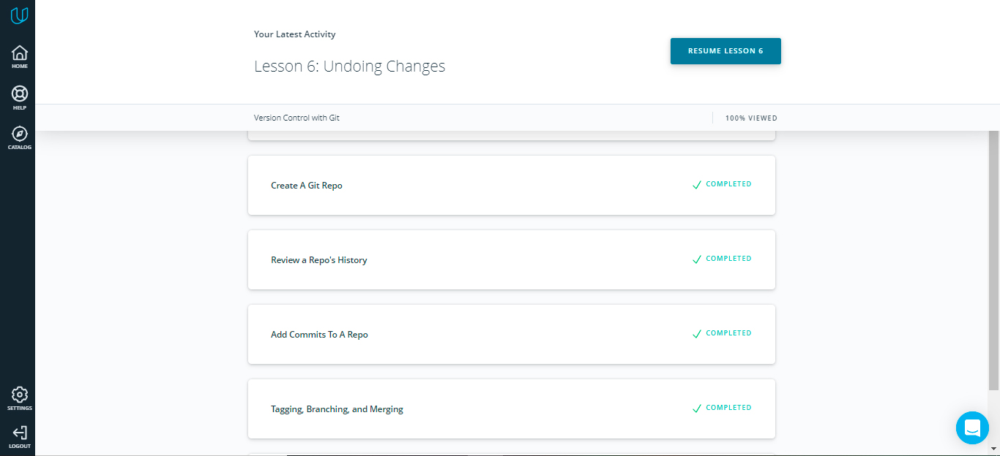

```
$ git log --stat
```

The git log command has a flag **--stat** ("stat" is short for "statistics") that can be used to display the files that have been changed in the commit, as well as the number of lines that have been added or deleted


This command:
displays the file(s) that have been modified
displays the number of lines that have been added/removed
displays a summary line with the total number of modified files and lines that have been added/removed

<details>
  <summary>
    <strong>More git commands</strong>
  </summary>

```
$ git log --oneline
$ git log --stat fdf5493
$ git show -p fdf5493

$ git rm --cached index.html

$ git diff

$ git tag -a v1.0
$ git tag
$ git log --decorate
$ git tag -d v1.0
$ git tag --delete v1.0
$ git tag -a v1.0 73341bb
$ git tag -a beta b552fa5
```
This command will:
add a tag to the most recent commit
add a tag to a specific commit if a SHA is passed
```
$ git branch
$ git checkout sidebar
$ git log --oneline --decorate

$ git branch heading-update a33e0b3
$ git branch alt-sidebar-loc 42a69f
```
It creates a new branch called alt-sidebar-loc and has it pointing at the commit with the SHA 42a69f
```
$ git branch -d sidebar
$ git branch -D sidebar

$ git checkout -b richards-branch-for-awesome-changes
```
This shows all branches and therefore all commits in the repository.
```
$ git log --oneline --decorate --graph --all
```
</details>

If you make a merge on the wrong branch, use this command to undo the merge:
```
$ git reset --hard HEAD^
```
+ There are two types of merges:

  + Fast-forward merge – the branch being merged in must be ahead of the checked out branch. The checked out branch's pointer will just be moved forward to point to the same commit as the other branch.

  + The regular type of merge –
		two divergent branches are combined
		a merge commit is created
```
$ git revert <SHA-of-commit-to-revert>
```
This command:
will undo the changes that were made by the provided commit
creates a new commit to record the change.

```
$ git branch backup
```

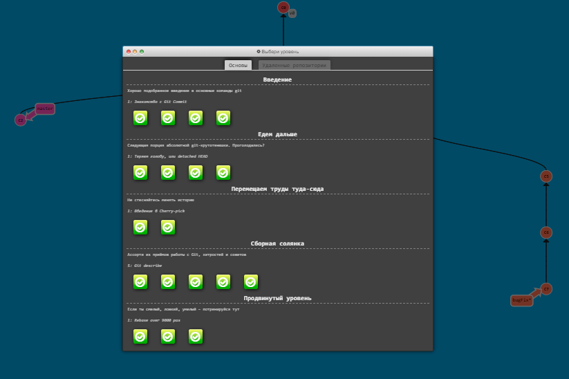

### [:top: Top](#top)

#
### <a name="cloud">:cloud:</a> 2. Linux CLI and HTTP

| 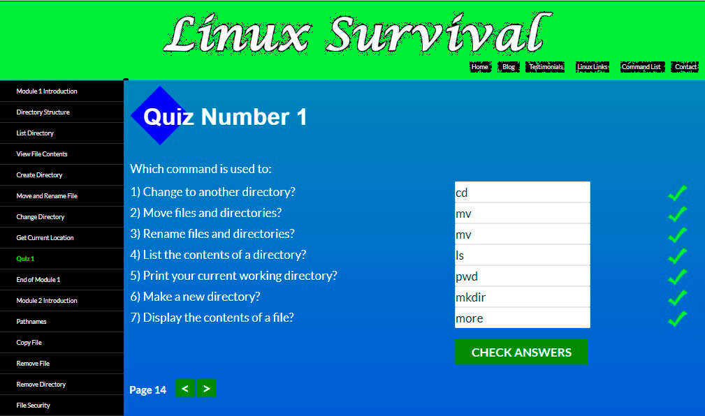  |
| :----------------------------------------------------------------------------------------------------------------------: |
| 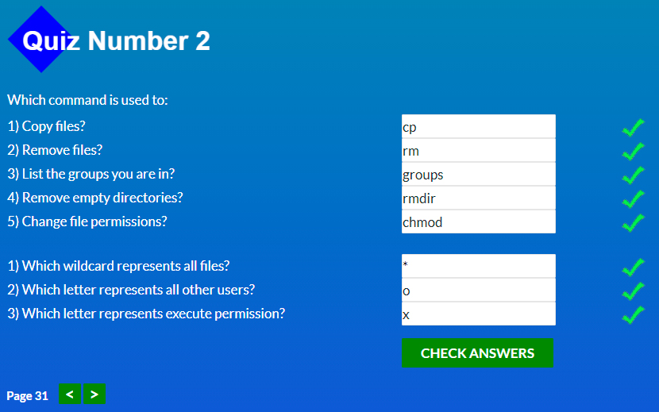 |
| 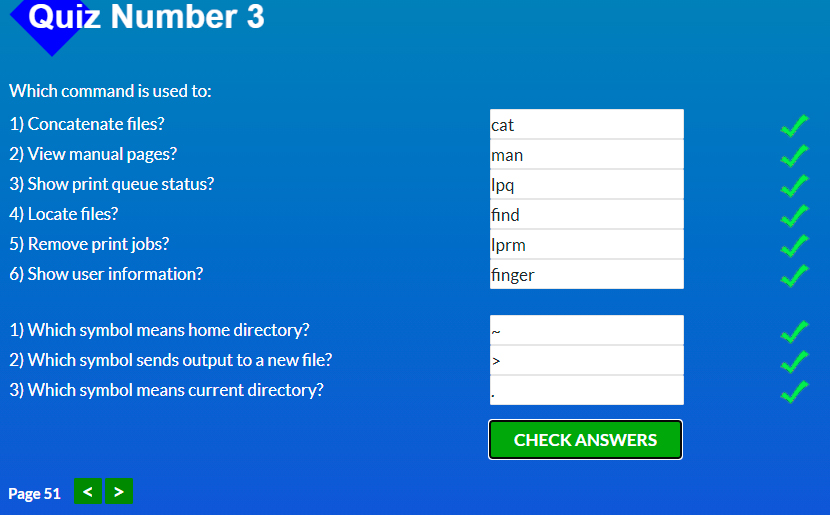  |
| 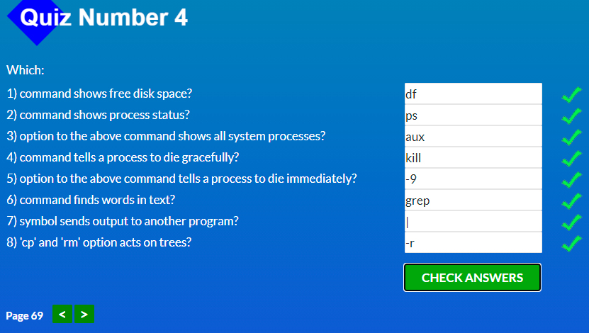 |

### [:top: Top](#top)

#
### <a name="raised_hands">:raised_hands:</a> 3. Git Collaboration

From this course I learned about an interesting service on github, [stars](https://github.com/stars). Here you can see statistics for the starred repositories. Filter them by different parameters.


```
$ git remote
$ git remote -v
$ git fetch origin master
$ git shortlog
```
The terminal showing the results of running the git shortlog command. It displays all commits sorted by author.

```
$ git shortlog -s -n
```
To show only the number of commits each author has made, sorted numerically.

```
$ git log --author=Surma
$ git log --author="Paul Lewis"
$ git show 5966b66
$ git log --grep=bug
$ git log --grep bug
```

*If you don't know what grep is then the **--grep** flag might not seem like a logical choice for the flag's name. Grep is a pattern matching tool. If you were to run git log --grep "fort", then Git will display only the commits that have the character f followed by the character o followed by r followed by t.*

```
$ git log --grep "css bug"
$ git log --grep="border radius issue in Safari"
```
<details>
  <summary>
    <strong>This will give us a connection to the source repository</strong>
  </summary>

  ```
$ git remote add upstream https://github.com/udacity/course-collaboration-travel-plans.git
```
This will give us a connection to the source repository.

```
$ git remote rename mine origin
$ git remote rename source-repo upstream
```
Resetting Remote Names

```
$ git remote add upstream https://github.com/kottans/mock-repo
$ git remote -v
$ git fetch upstream master
$ git log --oneline --graph --decorate --all
```
The terminal application showing the log of my local repository after fetching the upstream remote's changes.

*To make sure I'm on the correct branch for merging*

```
$ git checkout master
```

*Merge in Lam's changes*

```
$ git merge upstream/master
```

*Send Lam's changes to \*my\* remote*

```
$ git push origin master
```

*When working with a project that you've forked. The original project's maintainer will continue adding changes to their project. You'll want to keep your fork of their project in sync with theirs so that you can include any changes they make.*

To get commits from a source repository into your forked repository on GitHub you need to:

- get the cloneable URL of the source repository
- create a new remote with the git remote add command
  - use the shortname upstream to point to the source repository
  - provide the URL of the source repository
- fetch the new upstream remote
- merge the upstream's branch into a local branch
- push the newly updated local branch to your origin repo

</details>

<details>
  <summary>
    <strong>Interactive rebase</strong>
  </summary>

## Interactive rebase

```
$ git rebase -i <base>
```

### interactively rebase the commits to the one that's 3 before the one we're on

```
$ git rebase -i HEAD~3
```

**I recommend that you create a backup branch before rebasing, so that it's easy to return to your previous state. If you're happy with the rebase, then you can just delete the backup branch!**

### Rebase Commands

Let's take another look at the different commands that you can do with git rebase:

- use p or pick – to keep the commit as is
- use r or reword – to keep the commit's content but alter the commit message
- use e or edit – to keep the commit's content but stop before committing so that you can:
  - add new content or files
  - remove content or files
  - alter the content that was going to be committed
- use s or squash – to combine this commit's changes into the previous commit (the commit above it in the list)
- use f or fixup – to combine this commit's change into the previous one but drop the commit message
- use x or exec – to run a shell command
- use d or drop – to delete the commit

</details>

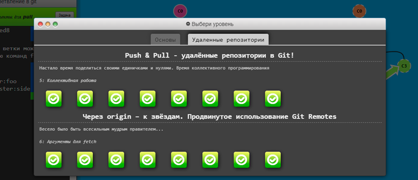

### [:top: Top](#top)

#
### <a name="sparkles">:sparkles:</a> 4. Intro to HTML and CSS

| 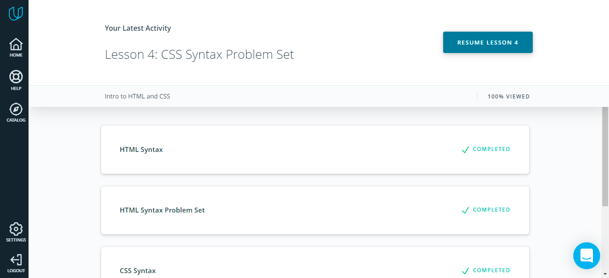 |
| :---------------------------------------------------------------------------------------------------------------: |
|            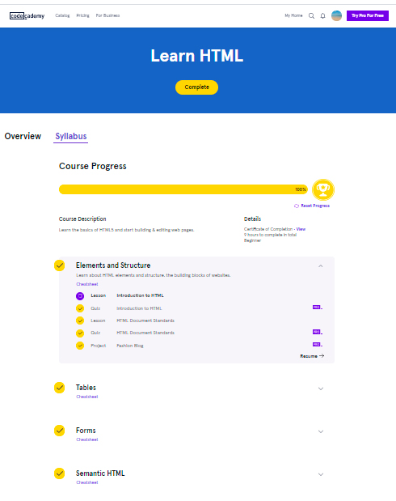            |
|             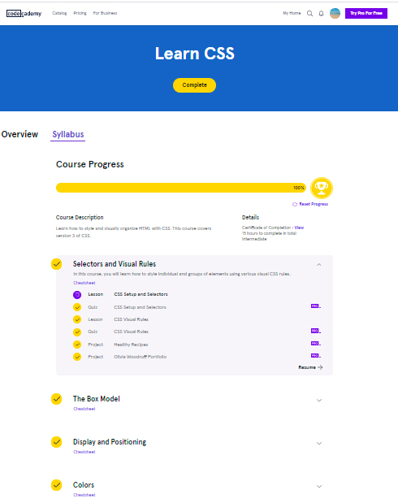             |

### [:top: Top](#top)

#
### <a name="fish">:fish:</a> 5. Responsive Web Design

|  |
| :-----------------------------------------------------------------------------------------------------------------------------: |
|        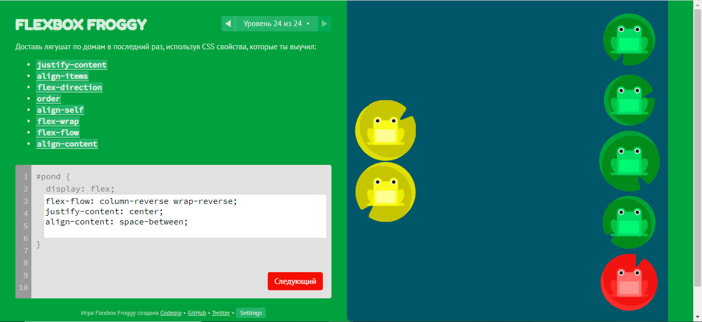        |

<details>
  <summary>
    <strong>Extra materials</strong>
  </summary>

  [Mostly fluid](./responsive_web_design/mostly-fluid/mostly-fluid.html)

  The difference between responsive design and adaptive design is that responsive design adapts the rendering of a single page version. In contrast, adaptive design delivers multiple completely different versions of the same page.

| 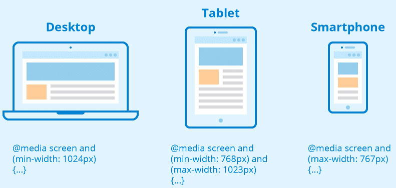 |
| :-------------------------------------------------------------------------: |
|  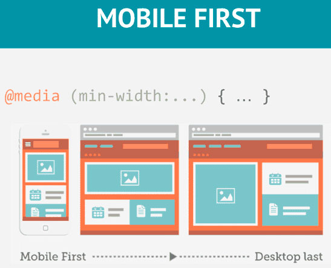  |


```

```

```
img {
  width: 100%;
}

.full-width-img {
  width: 100%;
}


#owl {
  width: 640px;
  max-width: 100%;
}
```

```
@media screen and (min-width: 780px) {
  .full-width-img {
    margin: auto;
    width: 90%;
  }
}
```
If the screen is at least 780 pixels wide, “full-width-img” class images will take up 90% of the screen and be automatically centered by equally wide margins.

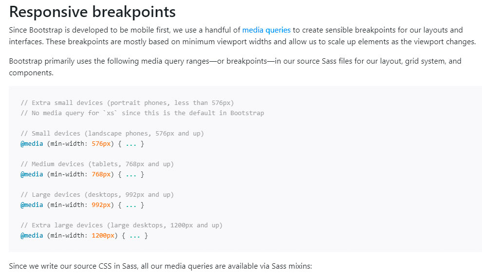


```
#wrapper {width:95%;  margin: 0 auto; }

#header {width:100%; }

#content {width:100%; }

#sidebar {width:100%; }

#footer {width:100%; }

// Small devices (landscape phones, 576px and up)

@media (min-width: 576px) {

// Medium devices (tablets, 768px and up)

@media (min-width: 768px) {

#wrapper {width:90%;  margin: 0 auto; }

#content {width:70%; float:left; }

#sidebar {width:30%; float:right; }

// Large devices (desktops, 992px and up)

@media (min-width: 992px) { ... }

}

// Extra large devices (large desktops, 1200px and up)

@media (min-width: 1200px) {

#wrapper {width:90%;  margin: 0 auto; }

}
```

Using a mobile-first approach, you can style the main layout elements like this (with no media query for the basic styles for mobile phones)

</details>

### [:top: Top](#top)

#
### <a name="beetle">:beetle:</a> 6. HTML-CSS-Popup

[Demo](https://njul.github.io/hooli-style-popup/) |
[Code base](https://github.com/NJul/hooli-style-popup)

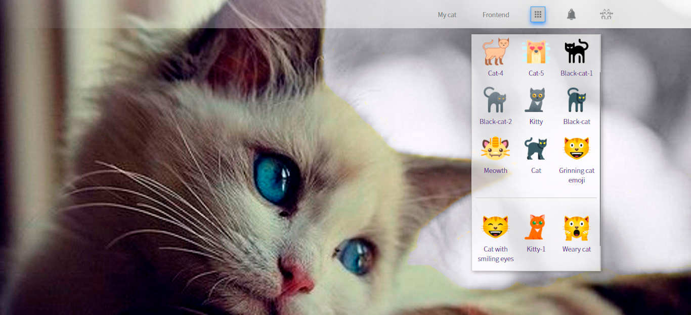

### [:top: Top](#top)

#
### <a name="high_brightness">:high_brightness:</a> 7. JavaScript Basics

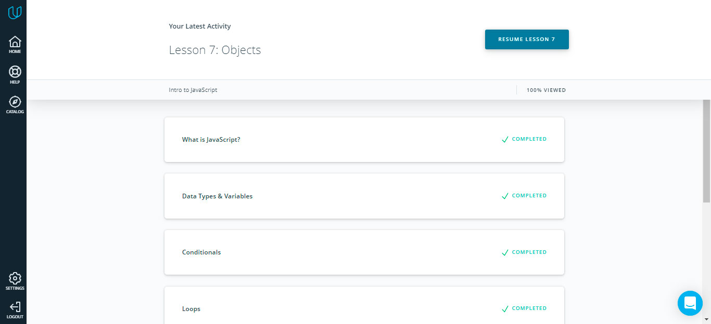

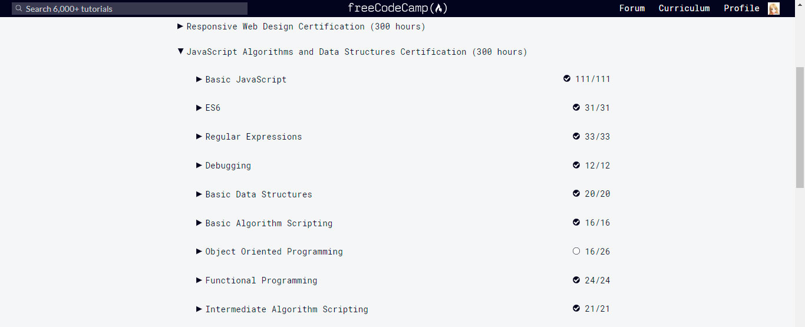

### [:top: Top](#top)

#
### <a name="european_castle">:european_castle:</a> 8. Document Object Model

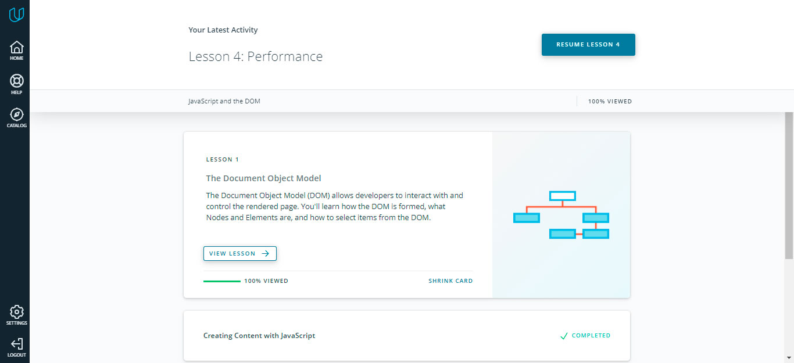

[Demo](https://njul.github.io/dom-api-task/) |
[Code base](https://github.com/NJul/dom-api-task)

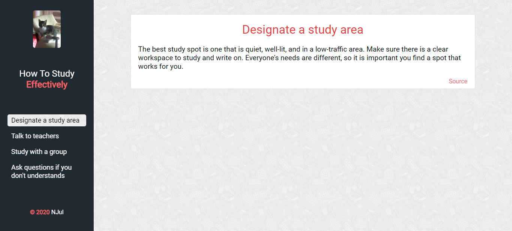

### [:top: Top](#top)

#
### <a name="sunny">:sunny:</a> 9. Building a Tiny JS World (pre-OOP)

[Demo](https://njul.github.io/a-tiny-JS-world/) |
[Code base](https://github.com/NJul/a-tiny-JS-world/blob/master/index.js)

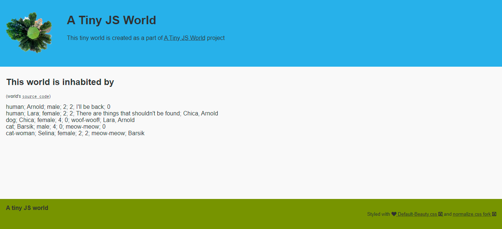

### [:top: Top](#top)

#
### <a name="japanese_castle">:japanese_castle:</a> 10.  Object-Oriented JavaScript

Codewars: [https://www.codewars.com/users/NJul](https://www.codewars.com/users/NJul)

### [:top: Top](#top)

#
### <a name="snail">:snail:</a> 11. OOP exercise

### [:top: Top](#top)

#
### <a name="grapes">:grapes:</a> 12. Offline Web Applications

### [:top: Top](#top)
