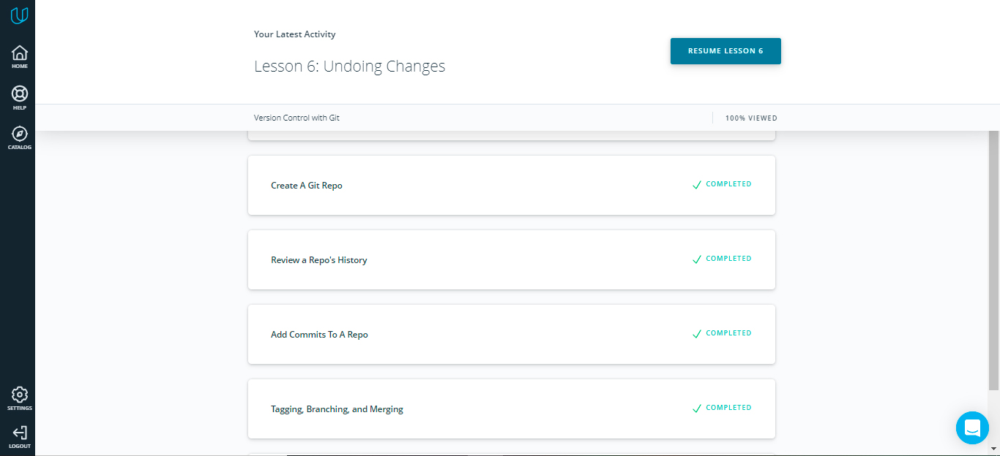

# kottans-frontend 🐈

<a name="top"></a>

### ✔ 1. Git Basics [:fire:](#fire)

### :white_large_square: 2. Linux CLI and HTTP :cloud:

### :white_large_square: 3. Git Collaboration :raised_hands:

#
### <a name="fire">:fire:</a> 1. Git Basics - Notes

I learned new commands from the [Version Control with Git](https://www.udacity.com/course/version-control-with-git--ud123) course




```
$ git log --stat
```

The git log command has a flag **--stat** ("stat" is short for "statistics") that can be used to display the files that have been changed in the commit, as well as the number of lines that have been added or deleted 

This command:
displays the file(s) that have been modified
displays the number of lines that have been added/removed
displays a summary line with the total number of modified files and lines that have been added/removed
```
$ git log --oneline
$ git log --stat fdf5493
$ git show -p fdf5493

$ git rm --cached index.html

$ git diff

$ git tag -a v1.0
$ git tag
$ git log --decorate
$ git tag -d v1.0
$ git tag --delete v1.0
$ git tag -a v1.0 73341bb
$ git tag -a beta b552fa5
```
This command will:
add a tag to the most recent commit
add a tag to a specific commit if a SHA is passed
```
$ git branch
$ git checkout sidebar
$ git log --oneline --decorate

$ git branch heading-update a33e0b3
$ git branch alt-sidebar-loc 42a69f
```
It creates a new branch called alt-sidebar-loc and has it pointing at the commit with the SHA 42a69f
```
$ git branch -d sidebar
$ git branch -D sidebar

$ git checkout -b richards-branch-for-awesome-changes
```
This shows all branches and therefore all commits in the repository.
```
$ git log --oneline --decorate --graph --all
```


If you make a merge on the wrong branch, use this command to undo the merge:
```
$ git reset --hard HEAD^
```
+ There are two types of merges:

  + Fast-forward merge – the branch being merged in must be ahead of the checked out branch. The checked out branch's pointer will just be moved forward to point to the same commit as the other branch.
	
  + The regular type of merge –
		two divergent branches are combined
		a merge commit is created
```
$ git revert <SHA-of-commit-to-revert>
```
This command:
will undo the changes that were made by the provided commit
creates a new commit to record the change.
```
$ git branch backup
```
### [:top: Top](#top)